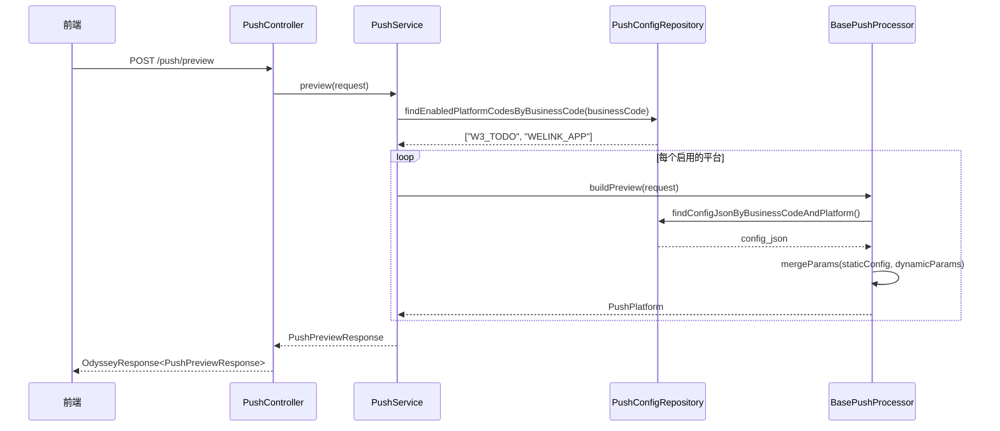
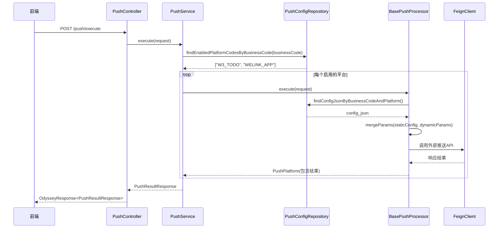

# 推送平台后端设计文档

**作者**：陈宇博（c00807372）  
**日期**：2026-01-27  
**版本**：1.0

---

## 1. 设计目标

- **配置化**：通过管理界面配置推送模板，无需修改代码
- **多平台支持**：支持 W3 代办、WeLink 应用号等多种推送渠道
- **简洁高效**：避免过度设计，保持代码清晰易维护
- **前端友好**：提供预览功能，执行结果明确反馈

---

## 2. 核心概念

### 2.1 业务类型（Business Type）
- 代表具体的业务场景，如 `QA_REPORT`、`TEST_REPORT`
- 通过 `business_code` 唯一标识
- 存储在 `push_business_type` 表中

### 2.2 推送平台（Push Platform）
- 代表具体的推送渠道，如 `W3_TODO`、`WELINK_APP`
- 每个平台有独立的参数格式和调用方式

### 2.3 推送配置（Push Config）
- 定义业务类型与推送平台的关联关系
- 包含平台特定的静态配置参数（JSON 格式）
- 支持启用/禁用开关

---

## 3. 数据库设计

### 3.1 业务类型表（push_business_type）

| 字段 | 类型 | 说明 |
|------|------|------|
| id | int(11) | 主键ID |
| business_code | varchar(50) | 业务编码（唯一） |
| business_name | varchar(100) | 业务名称 |
| create_user_id | varchar(64) | 创建人ID |
| created_time | datetime | 创建时间 |
| update_user_id | varchar(64) | 更新人ID |
| updated_time | datetime | 更新时间 |

**索引**：`UNIQUE KEY business_code (business_code)`

### 3.2 推送配置表（push_config）

| 字段 | 类型 | 说明 |
|------|------|------|
| id | int(11) | 主键ID |
| business_type_id | int(11) | 业务类型ID |
| platform_code | varchar(50) | 平台编码 |
| enabled | tinyint(4) | 是否启用（0-禁用，1-启用） |
| config_json | text | 推送配置JSON |
| create_user_id | varchar(64) | 创建人ID |
| created_time | datetime | 创建时间 |
| update_user_id | varchar(64) | 更新人ID |
| updated_time | datetime | 更新时间 |

**索引**：`UNIQUE KEY uk_business_platform (business_type_id, platform_code)`

---

## 4. 核心流程

### 4.1 预览流程



### 4.2 执行流程



---

## 5. 关键组件

### 5.1 Controller 层

#### PushController
- **职责**：接收 HTTP 请求，调用 Service 层
- **接口**：
    - `POST /push/preview` - 预览推送内容
    - `POST /push/execute` - 执行推送

### 5.2 Service 层

#### PushService
- **职责**：业务编排，协调各组件
- **核心方法**：
    - `preview(PushPreviewRequest)` - 生成预览
    - `execute(PushExecuteRequest)` - 执行推送

### 5.3 Processor 层

#### BasePushProcessor（接口）
```java
public interface BasePushProcessor {
    PushPlatform buildPreview(PushPreviewRequest request);
    PushPlatform execute(PushExecuteRequest request);
    String getPlatformCode();
}
```

#### 具体实现
- **W3TodoPushProcessor**：处理 W3 代办推送
- **WeLinkAppPushProcessor**：处理 WeLink 应用号推送

### 5.4 Repository 层

#### PushConfigRepository
- **核心方法**：
    - `findEnabledPlatformCodesByBusinessCode(String businessCode)` - 查询启用的平台
    - `findConfigJsonByBusinessCodeAndPlatform(String businessCode, String platformCode)` - 查询具体配置

### 5.5 工具类

#### PushParamMerger
- **职责**：合并静态配置和动态参数
- **规则**：一层 key-value 覆盖，动态参数优先

---

## 6. 参数处理机制

### 6.1 静态配置（config_json）
存储在数据库中的平台特定参数模板：

```json
// W3 代办示例
{
  "appId": "w3-app-001",
  "themeId": "qa-report-theme",
  "title": "默认标题",
  "content": "默认内容"
}

// WeLink 示例
{
  "appId": "welink-app-001",
  "templateTitleParams": "{\"tName\": \"{{title}}\"}",
  "templateContentParams": "{\"cName\": \"{{content}}\"}"
}
```

### 6.2 动态参数（dynamicParams）
前端传入的业务相关参数：

```json
{
  "title": "QA周报",
  "content": "第42周报告已生成",
  "jumpUrl": "https://example.com/report/123"
}
```

### 6.3 合并规则
- **覆盖原则**：动态参数覆盖同名的静态参数
- **新增原则**：动态参数中的新字段直接添加
- **一层合并**：不进行深度递归合并

### 6.4 接收人处理
- 接收人列表单独处理，不在动态参数中
- 各平台处理器根据自身格式要求处理接收人

---

## 7. 异常处理策略

### 7.1 预览异常
- **策略**：降级处理，不抛异常
- **行为**：返回包含错误信息的预览结果
- **目的**：保证前端始终能收到响应

### 7.2 执行异常
- **策略**：记录错误，继续执行其他平台
- **行为**：在结果中包含错误信息
- **目的**：部分失败不影响整体流程

### 7.3 业务异常
- **自定义异常**：`PushException extends OdysseyException`
- **全局处理**：由 `BaseExceptionHandler` 统一转换为友好响应

---

## 8. API 设计

### 8.1 预览接口

**请求**：
```json
POST /push/preview
{
  "businessCode": "QA_REPORT",
  "dynamicParams": {
    "title": "QA周报",
    "content": "第42周报告"
  },
  "receivers": [
    {
      "accountUuid": "uuid1",
      "userId": "c00807372",
      "userName": "陈宇博"
    }
  ]
}
```

**响应**：
```json
{
  "responseCode": 20000,
  "data": {
    "businessCode": "QA_REPORT",
    "pushPlatforms": [
      {
        "platformCode": "WELINK_APP",
        "platformName": "WeLink应用号",
        "previewParams": {
          "标题": "QA周报",
          "内容": "第42周报告",
          "接收人": "陈宇博(c00807372)"
        },
        "receivers": [...]
      }
    ]
  }
}
```

### 8.2 执行接口

**请求**：同预览接口

**响应**：
```json
{
  "responseCode": 20000,
  "data": {
    "businessCode": "QA_REPORT",
    "pushPlatforms": [...],
    "success": true,
    "message": "推送成功"
  }
}
```

---

## 9. 扩展性设计

### 9.1 新增推送平台
1. 实现 `BasePushProcessor` 接口
2. 添加 `@Component` 注解
3. 在管理界面配置对应平台的静态参数

### 9.2 参数格式演进
- 静态配置存储在数据库，可随时修改
- 不需要修改代码即可调整推送模板
- 支持向后兼容的参数变更

### 9.3 性能优化
- 配置查询结果可缓存（按需）
- 多平台推送可并行执行（按需）

---

## 10. 最佳实践

### 10.1 配置管理
- 静态配置应包含合理的默认值
- 敏感信息（如 app_id）应通过配置中心管理
- 配置变更应有版本控制

### 10.2 错误处理
- 预览阶段尽量容错
- 执行阶段详细记录错误信息
- 提供重试机制（后续扩展）

### 10.3 监控告警
- 记录推送成功率
- 监控第三方平台响应时间
- 异常推送及时告警

---

## 11. 未来扩展

- **推送历史查询**：记录每次推送的详细信息
- **定时推送**：支持定时任务触发推送
- **模板管理**：提供可视化模板编辑器
- **A/B 测试**：支持不同推送策略的对比测试

---

**文档结束**